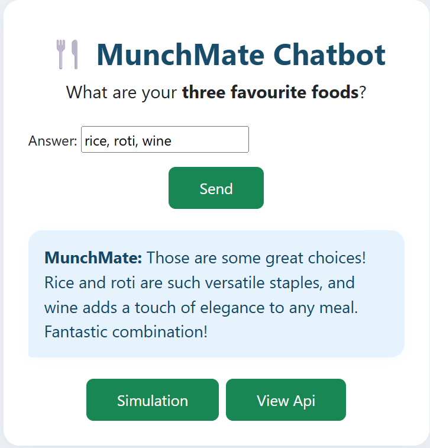

# 🥗 MunchMate Chatbot

A Django-powered chatbot to explore vegan and vegetarian food recommendations, simulate GPT-generated food conversations, and browse/save them via a web UI or API.

## Features

- 🍽️ Interactive chatbot interface
- 🪄 Simulate conversations (bulk, 100 at a time)
- 📖 View API results for all vegan/vegetarian submissions
- 📝 Admin interface for management 

## Screenshots

Main Chatbot:

Simulation & API Table:

## Quick Start
 
1. **Set your environment variables:**  
Create a `.env` file: OPENAI_API_KEY=your-real-openai-key

2. **Run the app:**
`docker-compose build`

The app runs at [http://localhost:8000/](http://localhost:8000/)

3. **Migrations:**
`docker-compose exec web python manage.py makemigrations` &
`docker-compose exec web python manage.py migrate`

## Endpoints

- `/` — Chatbot UI
- `/simulate/` — Run GPT simulation (admin/button)
- `/veggie-vegan-api/` — JSON API endpoint
- `/veggie-vegan/table/` — Human-friendly table

## Deployment and Containers

This app was built and tested as a **containerized Django application** (Docker), designed for cloud web hosting.

It was previously published and actively running as a containerized web app on **Microsoft Azure App Service**.  
> **Note:** The public Azure deployment is no longer live at this time, but this repository contains all required Docker and deployment files to enable easy redeployment on Azure or any other container-friendly cloud service.

## Containerization

- `Dockerfile` and `docker-compose.yml` provided for easy local or cloud builds.
- Run with `docker build`/`compose` to use in any Docker environment.

## Security

- Never commit your `.env` or API keys always add `.env` to `.gitignore`.
- Credentials and secrets should only be set in local files not committed to git.

---

